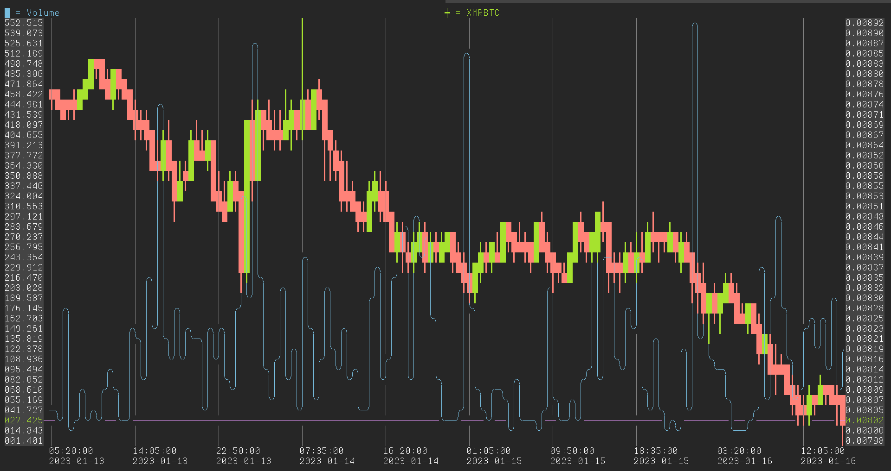

# COMPLOT :: ASCII live plotting in c

Complot is a C library that can do live plotting in ncurses.  
Included is an example application that plots financial data streamed from binance.  

# Controls:

    q       quit

    h, ←    pan left
    j, ↓    pan down
    k, ↑    pan up
    l, →    pan right

    L       zoom out
    H       zoom in

    n       open new plot
    d       close selected plot
    K       move selection up
    J       move selection down

    r       reset view
    R       toggle y axis autorange for selected plot
    i       select interval for selected plot

    x       display log window
    s       toggle status bar
    g       toggle grid

# Compile and run

There are no dependencies so a simple make will do.  

    make
    ./complot -s XMRBTC
